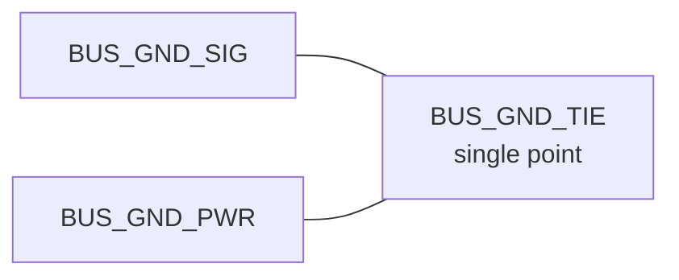
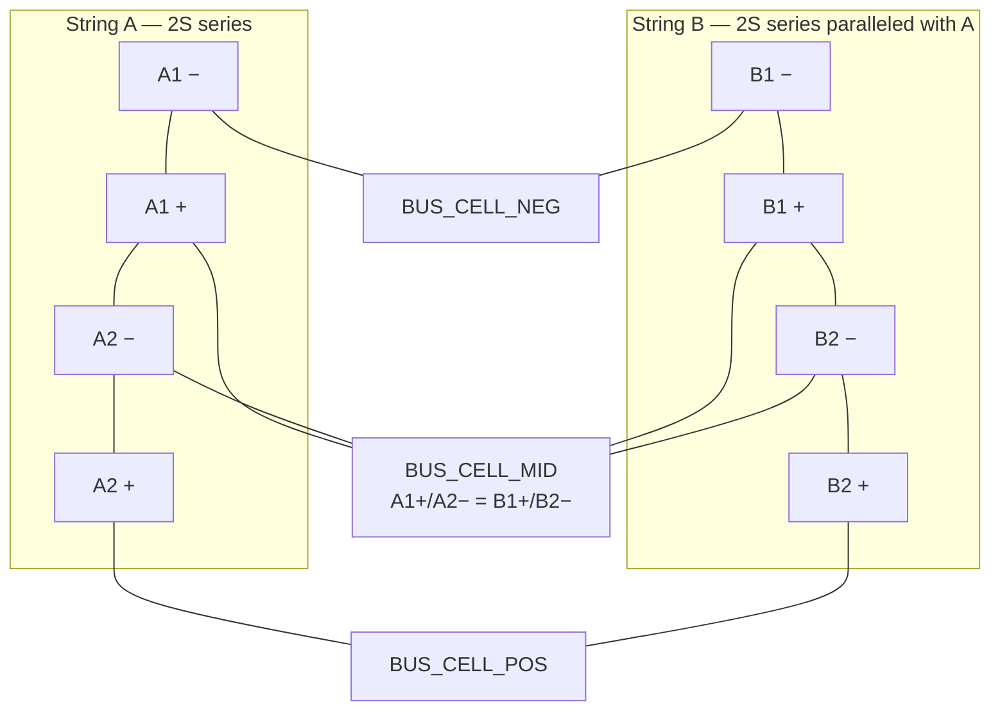
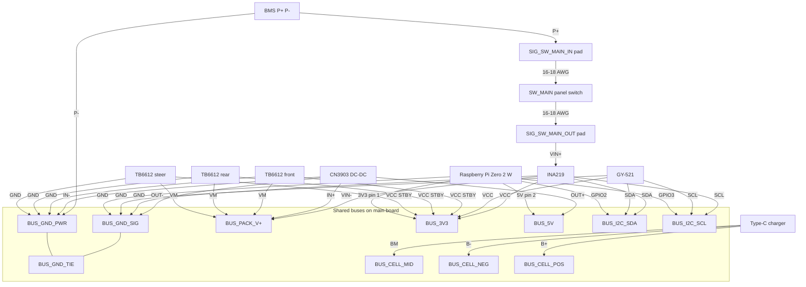
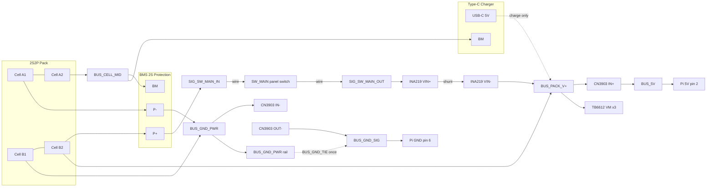
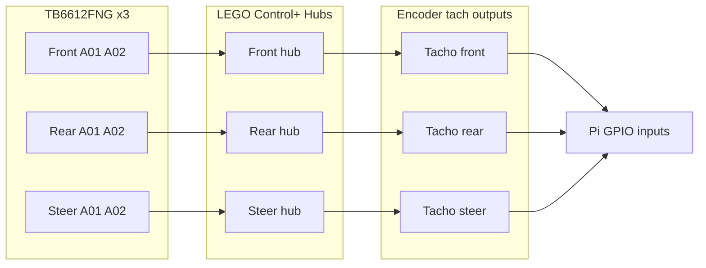
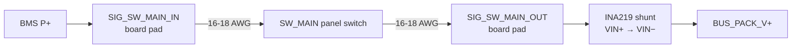
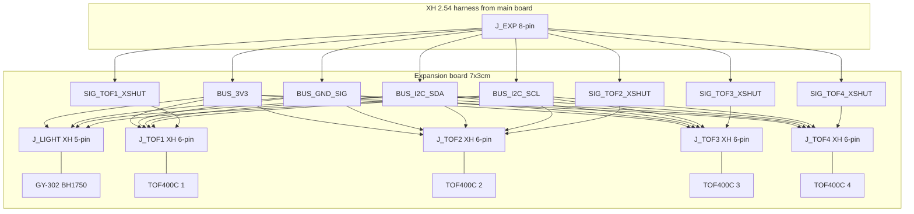
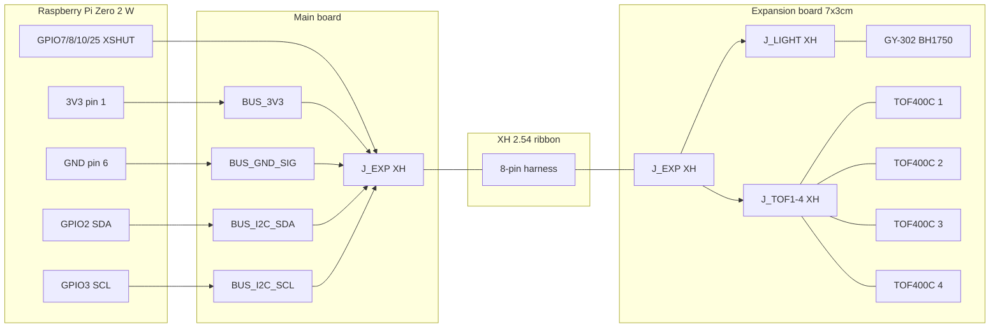

# FPV Rover Wiring Schema

Hardware wiring reference for the FPV Rover prototype: **main board** (power, motion, IMU) and **expansion board** (light + ToF sensors). Main ↔ expansion link and expansion-board modules use **XH 2.54** connectors. The Raspberry Pi Zero 2 W mates with the main board through **`J_PI` — a 2×20 male pin header (гребёнка) soldered on the main board**, wired to all shared buses including `BUS_5V`. Panel power switch `SW_MAIN` uses **direct 16–18 AWG wires** to main-board solder pads (not XH).

| Property | Main board | Expansion board |
|----------|------------|-----------------|
| Board size | 70 × 90 mm (7 × 9 cm) | 70 × 30 mm (7 × 3 cm) |
| Hole grid | 31 × 26 | ~27 × 11 |
| Hole pitch | 2.54 mm | 2.54 mm |
| Layers | Double-sided prototype PCB | Double-sided prototype PCB |
| Host | [Raspberry Pi Zero 2 W](https://www.raspberrypi.com/products/raspberry-pi-zero-2-w/) on **`J_PI` 2×20 male pin header** (board-mounted) | Via main board `J_EXP` harness |

Software GPIO and I2C defaults live in [`.env.example`](.env.example). **This document is the physical wiring source of truth.**

---

## Main board

### Wiring concept: shared buses

All shared rails are **one physical bus per voltage or signal** on the perfboard (copper strip, solder rail, or wire wrap along a hole row). Every module **taps** the bus — nothing chains power or I2C through another module.

**Assembly tip:** on the 7 × 9 cm perfboard, run each `BUS_*` along a dedicated row of holes (2.54 mm pitch). Connect modules with short tap wires.

**Ground:** use **two separate ground buses** — signal and power — joined at **one tie point** only (see below).

### Bus glossary

| Bus identifier | Voltage / signal | Source | Consumers (tap onto bus) |
|----------------|------------------|--------|--------------------------|
| `BUS_GND_SIG` | 0 V signal / logic | Pi GND pin, CN3903 `OUT−` | Pi GND, INA219 `GND`, MPU6050 `GND` + `AD0`, CN3903 `OUT−` |
| `BUS_GND_PWR` | 0 V power / high current | BMS `P−` | BMS `P−`, CN3903 `IN−`, TB6612 `GND` ×3 |
| `BUS_GND_TIE` | Ground tie (single point) | — | **One** short link between `BUS_GND_SIG` and `BUS_GND_PWR` (at CN3903 DC-DC or BMS `P−`) |
| `BUS_PACK_V+` | 7.4–8.4 V protected (switched, post-shunt) | INA219 `VIN−` (shunt output; fed from `SIG_SW_MAIN_OUT` → `VIN+`) | CN3903 `IN+`, TB6612 `VM` ×3 |
| `BUS_5V` | 5 V | CN3903 `OUT+` (only source) | Pi `5V` pin 2 |
| `BUS_3V3` | 3.3 V logic | Pi `3V3` pin 1 (only source) | INA219 `VCC`, MPU6050 `VCC`, TB6612 `VCC` + `STBY` ×3 |
| `BUS_I2C_SDA` | I2C data | Pi `GPIO2` pin 3 | INA219 `SDA`, MPU6050 `SDA`, `J_EXP` pin 3 |
| `BUS_I2C_SCL` | I2C clock | Pi `GPIO3` pin 5 | INA219 `SCL`, MPU6050 `SCL`, `J_EXP` pin 4 |
| `J_PI` | Raspberry Pi header (2×20 pin header **male**, 2.54 mm) | Main-board connector | Pi Zero 2 W plugs onto it; carries `BUS_5V`, `BUS_3V3`, `BUS_GND_SIG`, `BUS_I2C_SDA`, `BUS_I2C_SCL` and all `SIG_*` GPIO lines |
| `J_EXP` | Expansion harness (8-pin XH 2.54) | Main-board connector | Exports `BUS_3V3`, `BUS_GND_SIG`, `BUS_I2C_SDA`, `BUS_I2C_SCL`, `SIG_TOF1_XSHUT`–`SIG_TOF4_XSHUT` to expansion board |
| `BUS_CELL_MID` | Cell midpoint ~4.2 V | 2S2P pack balance tap | BMS `BM`, charger `BM` |
| `BUS_CELL_NEG` | Cell negative (pre-BMS) | Pack `-` | BMS `B-`, charger `B-` |
| `BUS_CELL_POS` | Cell positive (pre-BMS) | Pack `+` | BMS `B+`, charger `B+` |

### Split ground (signal vs power)

Two ground buses keep motor and pack return currents off the Pi and I2C reference:

| Bus | Role | Typical loads |
|-----|------|----------------|
| `BUS_GND_SIG` | Logic, Pi, sensors | Raspberry Pi, INA219, GY-521 (MPU6050), CN3903 5 V return |
| `BUS_GND_PWR` | Pack and motor returns | BMS `P−`, CN3903 high-side input, TB6612 ×3 |

**Tie rule:** connect `BUS_GND_SIG` and `BUS_GND_PWR` at **exactly one point** — recommended at the CN3903 DC-DC (`IN−` ↔ `OUT−` area) or adjacent to BMS `P−`. Use one short, thick wire or a single solder bridge. Do **not** daisy-chain multiple ties.

**GPIO control lines** (PWMA, AIN1, AIN2, tacho) are **dedicated point-to-point** wires Pi ↔ driver. Document them as `SIG_*` nets (e.g. `SIG_FRONT_PWMA`).

**Identifier rules:**

- Shared rails: `BUS_{NAME}`
- Dedicated signals: `SIG_{MODULE}_{SIGNAL}`
- Module-local: `{OWNER}_{SIGNAL}`

### 2S2P cell layout

Four 18650 Li-ion cells in **2S2P** configuration:

- **String A:** Cell A1 (−) → Cell A2 (+)
- **String B:** Cell B1 (−) → Cell B2 (+)
- **Parallel:** String A and String B share the same `BUS_CELL_NEG`, `BUS_CELL_MID`, and `BUS_CELL_POS`

Each string is two cells in **series** (`flowchart` left-to-right inside the subgraph). **Parallel** ties join both strings to the same three pack buses.

**BMS soldering order:** connect `B-` first, then `BM`, then `B+` (standard 2S protection practice).

**Power path:** cells → BMS → **`SIG_SW_MAIN_IN` / panel `SW_MAIN` / `SIG_SW_MAIN_OUT`** (series) → **INA219 shunt (`VIN+` → `VIN−`)** → `BUS_PACK_V+` / `BUS_GND_PWR` → {CN3903 DC-DC input, TB6612 VM}; CN3903 `OUT−` → `BUS_GND_SIG` → Pi; Pi sources `BUS_3V3` and `BUS_I2C_*` → {INA219, MPU6050, TB6612 logic}; `BUS_GND_SIG` ↔ `BUS_GND_PWR` tied once at CN3903 DC-DC / BMS; Type-C charger taps `BUS_CELL_*` in parallel with BMS cell pads (not through BMS output or `SW_MAIN`).

---

### Connection diagrams

#### Diagram 0 — Bus topology overview

All shared buses as backbone rails; modules tap in (star topology).

#### Diagram 1 — Power and pack wiring

Battery → BMS → pack bus → loads. USB-C charger taps cell balance points.

Protected pack voltage feeds high-power loads on `BUS_GND_PWR` through `SIG_SW_MAIN_IN` → panel `SW_MAIN` → `SIG_SW_MAIN_OUT` → INA219 shunt (`VIN+` → `VIN−`) in series on the `P+` path, so **all** pack current is measured before it reaches `BUS_PACK_V+`; CN3903 `OUT−` and Pi GND sit on `BUS_GND_SIG`, tied once to power ground. With `SW_MAIN` **OFF**, `BUS_PACK_V+` is isolated — Pi, CN3903 DC-DC, and motor drivers have no pack feed (charger on `BUS_CELL_*` still works).

#### Diagram 2 — Raspberry Pi GPIO and I2C connections

All Pi connections terminate at the board-mounted **`J_PI` 2×20 male pin header** (BCM + physical pin on labels) — the Pi plugs onto it, no flying wires.

```mermaid
flowchart TB
  subgraph pi [Raspberry Pi Zero 2 W]
    P_5V["5V pin 2"]
    P_3V3["3V3 pin 1"]
    P_GND["GND pin 6"]
    P_SDA["GPIO2 pin 3 I2C SDA"]
    P_SCL["GPIO3 pin 5 I2C SCL"]
    P_G18["GPIO18 pin 12"]
    P_G23["GPIO23 pin 16"]
    P_G24["GPIO24 pin 18"]
    P_G17["GPIO17 pin 11"]
    P_G27["GPIO27 pin 13"]
    P_G12["GPIO12 pin 32"]
    P_G16["GPIO16 pin 36"]
    P_G20["GPIO20 pin 38"]
    P_G5["GPIO5 pin 29"]
    P_G6["GPIO6 pin 31"]
    P_G13["GPIO13 pin 33"]
    P_G19["GPIO19 pin 35"]
    P_G26["GPIO26 pin 37"]
    P_G21["GPIO21 pin 40"]
    P_G22["GPIO22 pin 15"]
  end

  BEC[CN3903 DC-DC]
  INA[INA219]
  IMU[GY-521 MPU6050]
  DRV_F[DRV Front TB6612]
  DRV_R[DRV Rear TB6612]
  DRV_S[DRV Steer TB6612]

  BEC -->|OUT+| P_5V
  BEC -->|OUT-| P_GND

  INA -->|SDA| P_SDA
  INA -->|SCL| P_SCL
  INA -->|VCC| P_3V3
  INA -->|GND| P_GND

  IMU -->|SDA| P_SDA
  IMU -->|SCL| P_SCL
  IMU -->|VCC| P_3V3
  IMU -->|GND| P_GND

  DRV_F -->|PWMA| P_G18
  DRV_F -->|AIN1| P_G23
  DRV_F -->|AIN2| P_G24
  DRV_F -->|Tacho A| P_G17
  DRV_F -->|Tacho B| P_G27

  DRV_R -->|PWMA| P_G12
  DRV_R -->|AIN1| P_G16
  DRV_R -->|AIN2| P_G20
  DRV_R -->|Tacho A| P_G5
  DRV_R -->|Tacho B| P_G6

  DRV_S -->|PWMA| P_G13
  DRV_S -->|AIN1| P_G19
  DRV_S -->|AIN2| P_G26
  DRV_S -->|Tacho A| P_G21
  DRV_S -->|Tacho B| P_G22

  DRV_F -->|VCC STBY| P_3V3
  DRV_R -->|VCC STBY| P_3V3
  DRV_S -->|VCC STBY| P_3V3
```

I2C and 3.3 V modules tap `BUS_I2C_*` / `BUS_3V3` at the Pi header. Motor control uses dedicated `SIG_*` wires.

#### Diagram 3 — Motor outputs and encoders

TB6612 drives LEGO Control+ hubs; encoder tach signals return to Pi GPIO (not through the driver).

---

### Component pin tables

#### 1. 2S2P Li-ion pack (4× 18650)

Four 18650 cells, two series strings paralleled (2S2P). Nominal 7.4 V, full charge 8.4 V.

| # | Name | Description | Identifier | Connect to | Raspberry Pi |
|---|------|-------------|------------|------------|--------------|
| 1 | Pack negative | Common negative of both parallel strings | `CELL_PACK_NEG` | `BUS_CELL_NEG` | — |
| 2 | Pack midpoint | Junction between upper and lower cell in series | `CELL_PACK_MID` | `BUS_CELL_MID` | — |
| 3 | Pack positive | Common positive of both parallel strings | `CELL_PACK_POS` | `BUS_CELL_POS` | — |

---

#### 2. BMS 2S protection board

**Size:** 48.4 × 20.1 mm  
**Product:** [AliExpress — 2S BMS battery charge controller](https://aliexpress.ru/item/1005004118305965.html?spm=a2g2w.orderdetail.0.0.de144aa6WR8x5i&sku_id=12000056589647603)

2S lithium protection with balancing. Output `P+` / `P-` is the protected pack bus.

| # | Name | Description | Identifier | Connect to | Raspberry Pi |
|---|------|-------------|------------|------------|--------------|
| 1 | B− | Battery negative (Cell 1 −) | `BMS2S_BMINUS` | `BUS_CELL_NEG` | — |
| 2 | BM / B1 | Midpoint between Cell 1 and Cell 2 | `BMS2S_BMID` | `BUS_CELL_MID` | — |
| 3 | B+ | Battery positive (Cell 2 +) | `BMS2S_BPLUS` | `BUS_CELL_POS` | — |
| 4 | P− | Protected pack negative output | `BMS2S_PMINUS` | `BUS_GND_PWR` | — |
| 5 | P+ | Protected pack positive output | `BMS2S_PPLUS` | `SIG_SW_MAIN_IN` | — |

---

#### 3. Main power switch (latching push button)

**Product:** [Ozon — круглая клавишная кнопка-выключатель без подсветки, вкл/выкл (2 шт.)](https://ozon.by/product/kruglaya-klavishnaya-knopka-vyklyuchatel-bez-podsvetki-vkl-vykl-tehnologiya-2sht-1317482531/?is_apparel_size_selected=true)

Round panel-mount **SPST latching** push switch (no backlight). Press once → **ON** (contacts closed); press again → **OFF** (contacts open). Two solder pins on the switch body — polarity does not matter.

**Role:** main **pack output disconnect** on the high side. Breaks `BMS P+` from the INA219 shunt input (`VIN+`) and therefore from the switched load bus `BUS_PACK_V+` behind it (CN3903 DC-DC, TB6612 `VM` ×3). When **OFF**, the Pi and motors are fully depowered with no quiescent draw on the protected output.

**Does not switch:** cell-side charge path (`BUS_CELL_*` → Type-C charger) or BMS protection — USB charging remains possible with the button **OFF**.

**Link to main board:** **two direct wires** (16–18 AWG), soldered at the switch and at dedicated **main-board pads**. No connector on the power path. The switch is **in series** — there is **no** on-board jumper between `SIG_SW_MAIN_IN` and `SIG_SW_MAIN_OUT`.

| Property | Typical value |
|----------|---------------|
| Contacts | 2-pin SPST |
| Action | Latching ON / OFF (with detent) |
| Mount | Panel cutout ~12 mm (round); nut from rear |
| Wire | **16–18 AWG** silicone; strain relief at switch and cable entry |
| Rating | Verify on listing; similar KCD1-class parts are often **3–6 A @ 250 V AC** |

**Panel switch pins** (solder wires at the switch body):

| # | Name | Description | Identifier | Connect to | Raspberry Pi |
|---|------|-------------|------------|------------|--------------|
| 1 | Pin A | Wire to BMS side | `SW_MAIN_A` | `SIG_SW_MAIN_IN` via direct wire | — |
| 2 | Pin B | Wire to load bus side | `SW_MAIN_B` | `SIG_SW_MAIN_OUT` via direct wire | — |

**Main board — solder pads** (no connector; point-to-point `SIG_*` nets):

| Pad | Name | Description | Identifier | Connect to | Raspberry Pi |
|-----|------|-------------|------------|------------|--------------|
| IN | Series input | From BMS `P+` | `SIG_SW_MAIN_IN` | `BMS2S_PPLUS` | — |
| OUT | Series output | To INA219 shunt input | `SIG_SW_MAIN_OUT` | `INA219_VINPLUS` (`VIN+`; `BUS_PACK_V+` starts at `VIN−`) | — |

**Assembly:** mount `SW_MAIN` on the **rover body**; route both wires through a **cable grommet** with **strain relief** (tie wraps / adhesive anchor) so opening the enclosure does not stress solder joints. Use a **thick copper tap** or bus wire at each pad — do not feed pack current through a thin perfboard trace alone.

> **Safety:** treat `SW_MAIN` as a convenience disconnect, not a substitute for removing cells or isolating the pack during assembly. Open the switch before soldering or reworking the `P+` path.

---

#### 4. Type-C 2S USB charger (15 W, balanced)

**Product:** [Ozon — Type-C 2S USB BMS 15 W 8.4 V 1.5 A](https://ozon.by/product/modul-zaryada-li-ion-akkumulyatorov-type-c-2s-usb-bms-15w-8-4v1-5a-s-balansirovkoy-1sht-3825497145/?is_apparel_size_selected=true)

IP2326-based boost charger. Requires a separate protection BMS on the pack. Default 2S mode with onboard balancing. Thermal sensor key `tp5100` in `.env.example` maps to this module.

| # | Name | Description | Identifier | Connect to | Raspberry Pi |
|---|------|-------------|------------|------------|--------------|
| 1 | USB-C | 5 V input (Type-C port or solder pads) | `CHARGER_USBC_VIN` | External 5 V USB-C supply | — |
| 2 | B− | Battery negative input | `CHARGER_USBC_BMINUS` | `BUS_CELL_NEG` | — |
| 3 | BM | Balance midpoint input | `CHARGER_USBC_BMID` | `BUS_CELL_MID` | — |
| 4 | B+ | Battery positive input | `CHARGER_USBC_BPLUS` | `BUS_CELL_POS` | — |
| 5 | VIN | Alternate wired 5 V input (if present) | `CHARGER_USBC_VIN_PAD` | External 5 V supply | — |
| 6 | OUT+ / P+ | Boost output positive (if broken out) | `CHARGER_USBC_OUTPLUS` | — (not used; charge via B pads) | — |
| 7 | OUT− / P− | Boost output negative (if broken out) | `CHARGER_USBC_OUTMINUS` | — (not used) | — |

---

#### 5. CN3903 step-down DC-DC (5 V fixed)

**Product:** [Ozon — CN3903 step-down DC-DC (5 V, 3 pcs)](https://ozon.by/product/ponizhayushchiy-dc-dc-na-cn3903-5v-3-sht-942898517/?is_apparel_size_selected=true)

Step-down regulator (CN3903 IC). Fixed **5 V / 3 A** output, **5–30 V** input. Sole source of `BUS_5V`.

| # | Name | Description | Identifier | Connect to | Raspberry Pi |
|---|------|-------------|------------|------------|--------------|
| 1 | IN+ | Motor/pack voltage input | `BEC_CN3903_INPLUS` | `BUS_PACK_V+` | — |
| 2 | IN− | Input ground (power return) | `BEC_CN3903_INMINUS` | `BUS_GND_PWR` | — |
| 3 | OUT+ | Regulated output positive | `BEC_CN3903_OUTPLUS` | `BUS_5V` | 5V (pin 2) — `BUS_5V` source |
| 4 | OUT− | Regulated output ground (Pi return) | `BEC_CN3903_OUTMINUS` | `BUS_GND_SIG` | GND (pin 6) — `BUS_GND_SIG` tap |

> Place adequate input capacitance near the module. Tie `BUS_GND_PWR` and `BUS_GND_SIG` **once** at the CN3903 DC-DC (recommended) or at BMS `P−`.

---

#### 6. INA219 current/voltage sensor

**Product:** [AliExpress — INA219 DC sensor module](https://aliexpress.ru/item/32469098903.html?spm=a2g2w.orderdetail.0.0.397a4aa6uCM5jx&sku_id=12000057342623698)

High-side current/voltage monitor on I2C. Default address `0x40` (`ROVER_POWER_I2C_ADDRESS`).

| # | Name | Description | Identifier | Connect to | Raspberry Pi |
|---|------|-------------|------------|------------|--------------|
| 1 | VCC | Logic supply | `INA219_VCC` | `BUS_3V3` | 3V3 (pin 1) — `BUS_3V3` source |
| 2 | GND | Logic ground | `INA219_GND` | `BUS_GND_SIG` | GND (pin 6) — `BUS_GND_SIG` tap |
| 3 | SDA | I2C data | `INA219_SDA` | `BUS_I2C_SDA` | GPIO2 (pin 3) — `BUS_I2C_SDA` source |
| 4 | SCL | I2C clock | `INA219_SCL` | `BUS_I2C_SCL` | GPIO3 (pin 5) — `BUS_I2C_SCL` source |
| 5 | VIN+ | High-side shunt input (battery side) | `INA219_VINPLUS` | `SIG_SW_MAIN_OUT` (from `SW_MAIN`) | — |
| 6 | VIN− | High-side shunt output (load side) | `INA219_VINMINUS` | `BUS_PACK_V+` (source node) | — |
| 7 | A0 | I2C address bit 0 | `INA219_A0` | Tied on module (address `0x40`) | — |
| 8 | A1 | I2C address bit 1 | `INA219_A1` | Tied on module (address `0x40`) | — |

> `VIN+` / `VIN−` span the on-board shunt and are **two different nets**: `VIN+` sits on `SIG_SW_MAIN_OUT`, `VIN−` is the source node of `BUS_PACK_V+`. All pack current flows through the shunt before reaching any load — do **not** tap `VIN+` and `VIN−` onto the same bus rail, or the shunt is bypassed and the INA219 reads 0 A.

---

#### 7. GY-521 (MPU6050) IMU

**Product:** [AliExpress — GY-521 MPU6050 module](https://aliexpress.ru/item/1005008410243217.html?spm=a2g2w.orderdetail.0.0.6fc54aa6ySaXBR&sku_id=12000052230264891)

6-axis gyro + accelerometer. Default address `0x68` with `AD0` tied low (`ROVER_IMU_I2C_ADDRESS`).

| # | Name | Description | Identifier | Connect to | Raspberry Pi |
|---|------|-------------|------------|------------|--------------|
| 1 | VCC | Logic supply | `MPU6050_VCC` | `BUS_3V3` | 3V3 (pin 1) — `BUS_3V3` source |
| 2 | GND | Logic ground | `MPU6050_GND` | `BUS_GND_SIG` | GND (pin 6) — `BUS_GND_SIG` tap |
| 3 | SCL | I2C clock | `MPU6050_SCL` | `BUS_I2C_SCL` | GPIO3 (pin 5) — `BUS_I2C_SCL` source |
| 4 | SDA | I2C data | `MPU6050_SDA` | `BUS_I2C_SDA` | GPIO2 (pin 3) — `BUS_I2C_SDA` source |
| 5 | XDA | Auxiliary I2C data | `MPU6050_XDA` | NC | — |
| 6 | XCL | Auxiliary I2C clock | `MPU6050_XCL` | NC | — |
| 7 | AD0 | I2C address select | `MPU6050_AD0` | `BUS_GND_SIG` (address `0x68`) | GND (pin 6) — `BUS_GND_SIG` tap |
| 8 | INT | Interrupt output | `MPU6050_INT` | NC | — |

---

#### 8. TB6612FNG motor driver — front (drive)

**Product:** [AliExpress — TB6612FNG motor driver board](https://aliexpress.ru/item/1005007794705783.html?spm=a2g2w.orderdetail.0.0.43c84aa6MN8SJi&sku_id=12000042228397920)

Channel A drives the front LEGO Control+ hub. Channel B pins not used. `STBY` must be high for the H-bridge to operate.

| # | Name | Description | Identifier | Connect to | Raspberry Pi |
|---|------|-------------|------------|------------|--------------|
| 1 | VM | Motor power supply (2.2–13.5 V) | `DRV_FRONT_VM` | `BUS_PACK_V+` | — |
| 2 | VCC | Logic supply (2.7–5.5 V) | `DRV_FRONT_VCC` | `BUS_3V3` | 3V3 (pin 1) — `BUS_3V3` source |
| 3 | GND | Ground (motor return) | `DRV_FRONT_GND` | `BUS_GND_PWR` | — |
| 4 | STBY | Standby (active high) | `DRV_FRONT_STBY` | `BUS_3V3` | 3V3 (pin 1) — `BUS_3V3` source |
| 5 | PWMA | PWM speed input, channel A | `DRV_FRONT_PWMA` | `SIG_FRONT_PWMA` | GPIO18 (pin 12) — PWM0 |
| 6 | AIN1 | Direction input 1, channel A | `DRV_FRONT_AIN1` | `SIG_FRONT_AIN1` | GPIO23 (pin 16) |
| 7 | AIN2 | Direction input 2, channel A | `DRV_FRONT_AIN2` | `SIG_FRONT_AIN2` | GPIO24 (pin 18) |
| 8 | A01 | Motor output 1, channel A | `DRV_FRONT_A01` | `MOT_FRONT_OUT_A` | — |
| 9 | A02 | Motor output 2, channel A | `DRV_FRONT_A02` | `MOT_FRONT_OUT_B` | — |
| 10 | PWMB | PWM speed input, channel B | `DRV_FRONT_PWMB` | NC | — |
| 11 | BIN1 | Direction input 1, channel B | `DRV_FRONT_BIN1` | NC | — |
| 12 | BIN2 | Direction input 2, channel B | `DRV_FRONT_BIN2` | NC | — |
| 13 | B01 | Motor output 1, channel B | `DRV_FRONT_B01` | NC | — |
| 14 | B02 | Motor output 2, channel B | `DRV_FRONT_B02` | NC | — |
| 15 | Tacho A | Encoder channel A (on motor hub) | `ENC_FRONT_TACHO_A` | `SIG_FRONT_TACHO_A` | GPIO17 (pin 11) |
| 16 | Tacho B | Encoder channel B (on motor hub) | `ENC_FRONT_TACHO_B` | `SIG_FRONT_TACHO_B` | GPIO27 (pin 13) |

Env vars: `ROVER_MOTION_FRONT_PWMA_GPIO`, `ROVER_MOTION_FRONT_AIN1_GPIO`, `ROVER_MOTION_FRONT_AIN2_GPIO`, `ROVER_MOTION_FRONT_TACHO_A_GPIO`, `ROVER_MOTION_FRONT_TACHO_B_GPIO`.

> `GND` returns motor current on `BUS_GND_PWR`; logic I/O references `BUS_GND_SIG` via the single `BUS_GND_TIE`.

---

#### 9. TB6612FNG motor driver — rear (drive)

Same board type as front driver; channel A drives the rear LEGO Control+ hub.

| # | Name | Description | Identifier | Connect to | Raspberry Pi |
|---|------|-------------|------------|------------|--------------|
| 1 | VM | Motor power supply | `DRV_REAR_VM` | `BUS_PACK_V+` | — |
| 2 | VCC | Logic supply | `DRV_REAR_VCC` | `BUS_3V3` | 3V3 (pin 1) — `BUS_3V3` source |
| 3 | GND | Ground (motor return) | `DRV_REAR_GND` | `BUS_GND_PWR` | — |
| 4 | STBY | Standby (active high) | `DRV_REAR_STBY` | `BUS_3V3` | 3V3 (pin 1) — `BUS_3V3` source |
| 5 | PWMA | PWM speed input, channel A | `DRV_REAR_PWMA` | `SIG_REAR_PWMA` | GPIO12 (pin 32) — PWM0 |
| 6 | AIN1 | Direction input 1, channel A | `DRV_REAR_AIN1` | `SIG_REAR_AIN1` | GPIO16 (pin 36) |
| 7 | AIN2 | Direction input 2, channel A | `DRV_REAR_AIN2` | `SIG_REAR_AIN2` | GPIO20 (pin 38) |
| 8 | A01 | Motor output 1, channel A | `DRV_REAR_A01` | `MOT_REAR_OUT_A` | — |
| 9 | A02 | Motor output 2, channel A | `DRV_REAR_A02` | `MOT_REAR_OUT_B` | — |
| 10 | PWMB | PWM speed input, channel B | `DRV_REAR_PWMB` | NC | — |
| 11 | BIN1 | Direction input 1, channel B | `DRV_REAR_BIN1` | NC | — |
| 12 | BIN2 | Direction input 2, channel B | `DRV_REAR_BIN2` | NC | — |
| 13 | B01 | Motor output 1, channel B | `DRV_REAR_B01` | NC | — |
| 14 | B02 | Motor output 2, channel B | `DRV_REAR_B02` | NC | — |
| 15 | Tacho A | Encoder channel A (on motor hub) | `ENC_REAR_TACHO_A` | `SIG_REAR_TACHO_A` | GPIO5 (pin 29) |
| 16 | Tacho B | Encoder channel B (on motor hub) | `ENC_REAR_TACHO_B` | `SIG_REAR_TACHO_B` | GPIO6 (pin 31) |

Env vars: `ROVER_MOTION_REAR_PWMA_GPIO`, `ROVER_MOTION_REAR_AIN1_GPIO`, `ROVER_MOTION_REAR_AIN2_GPIO`, `ROVER_MOTION_REAR_TACHO_A_GPIO`, `ROVER_MOTION_REAR_TACHO_B_GPIO`.

---

#### 10. TB6612FNG motor driver — steer

Same board type; channel A drives the steering LEGO Control+ hub.

| # | Name | Description | Identifier | Connect to | Raspberry Pi |
|---|------|-------------|------------|------------|--------------|
| 1 | VM | Motor power supply | `DRV_STEER_VM` | `BUS_PACK_V+` | — |
| 2 | VCC | Logic supply | `DRV_STEER_VCC` | `BUS_3V3` | 3V3 (pin 1) — `BUS_3V3` source |
| 3 | GND | Ground (motor return) | `DRV_STEER_GND` | `BUS_GND_PWR` | — |
| 4 | STBY | Standby (active high) | `DRV_STEER_STBY` | `BUS_3V3` | 3V3 (pin 1) — `BUS_3V3` source |
| 5 | PWMA | PWM speed input, channel A | `DRV_STEER_PWMA` | `SIG_STEER_PWMA` | GPIO13 (pin 33) — PWM1 |
| 6 | AIN1 | Direction input 1, channel A | `DRV_STEER_AIN1` | `SIG_STEER_AIN1` | GPIO19 (pin 35) |
| 7 | AIN2 | Direction input 2, channel A | `DRV_STEER_AIN2` | `SIG_STEER_AIN2` | GPIO26 (pin 37) |
| 8 | A01 | Motor output 1, channel A | `DRV_STEER_A01` | `MOT_STEER_OUT_A` | — |
| 9 | A02 | Motor output 2, channel A | `DRV_STEER_A02` | `MOT_STEER_OUT_B` | — |
| 10 | PWMB | PWM speed input, channel B | `DRV_STEER_PWMB` | NC | — |
| 11 | BIN1 | Direction input 1, channel B | `DRV_STEER_BIN1` | NC | — |
| 12 | BIN2 | Direction input 2, channel B | `DRV_STEER_BIN2` | NC | — |
| 13 | B01 | Motor output 1, channel B | `DRV_STEER_B01` | NC | — |
| 14 | B02 | Motor output 2, channel B | `DRV_STEER_B02` | NC | — |
| 15 | Tacho A | Encoder channel A (on motor hub) | `ENC_STEER_TACHO_A` | `SIG_STEER_TACHO_A` | GPIO21 (pin 40) |
| 16 | Tacho B | Encoder channel B (on motor hub) | `ENC_STEER_TACHO_B` | `SIG_STEER_TACHO_B` | GPIO22 (pin 15) |

Env vars: `ROVER_MOTION_STEER_PWMA_GPIO`, `ROVER_MOTION_STEER_AIN1_GPIO`, `ROVER_MOTION_STEER_AIN2_GPIO`, `ROVER_MOTION_STEER_TACHO_A_GPIO`, `ROVER_MOTION_STEER_TACHO_B_GPIO`.

> Tacho rows are wired from the LEGO Control+ encoder outputs to Pi GPIO — they do not pass through the TB6612.

---

#### 11. Main board — `J_PI` Raspberry Pi header (2×20 pin header male)

**Connector:** 2×20 **male pin header** (гребёнка), 2.54 mm pitch, soldered on the main board. The Raspberry Pi Zero 2 W (with a female socket, or its stock male header mated via a 2×20 female–female adapter — recommended: solder a **female socket on the Pi** and plug it onto `J_PI`) mounts directly onto this header. `J_PI` pin numbering is **identical to the Pi 40-pin GPIO map** — pin 1 marked on silkscreen.
 
All shared buses — **including `BUS_5V`** — and all dedicated `SIG_*` GPIO lines terminate at `J_PI`; no flying header wires to the Pi.

**Connected pins** (all others unused, left unconnected):

| `J_PI` pin | Pi function (BCM) | Identifier / net | Role |
|---|------|------------|------|
| 1 | 3V3 | `BUS_3V3` | 3.3 V source from Pi |
| 2, 4 | 5V | `BUS_5V` | 5 V feed **into** Pi from CN3903 |
| 3 | GPIO2 (SDA) | `BUS_I2C_SDA` | I2C data |
| 5 | GPIO3 (SCL) | `BUS_I2C_SCL` | I2C clock |
| 6, 9, 14, 20, 25, 30, 34, 39 | GND | `BUS_GND_SIG` | Signal ground |
| 11 | GPIO17 | `SIG_FRONT_TACHO_A` | Front tacho A |
| 12 | GPIO18 | `SIG_FRONT_PWMA` | Front PWM |
| 13 | GPIO27 | `SIG_FRONT_TACHO_B` | Front tacho B |
| 15 | GPIO22 | `SIG_STEER_TACHO_B` | Steer tacho B |
| 16 | GPIO23 | `SIG_FRONT_AIN1` | Front AIN1 |
| 18 | GPIO24 | `SIG_FRONT_AIN2` | Front AIN2 |
| 19 | GPIO10 | `SIG_TOF3_XSHUT` | TOF #3 shutdown |
| 22 | GPIO25 | `SIG_TOF4_XSHUT` | TOF #4 shutdown |
| 24 | GPIO8 | `SIG_TOF2_XSHUT` | TOF #2 shutdown |
| 26 | GPIO7 | `SIG_TOF1_XSHUT` | TOF #1 shutdown |
| 29 | GPIO5 | `SIG_REAR_TACHO_A` | Rear tacho A |
| 31 | GPIO6 | `SIG_REAR_TACHO_B` | Rear tacho B |
| 32 | GPIO12 | `SIG_REAR_PWMA` | Rear PWM |
| 33 | GPIO13 | `SIG_STEER_PWMA` | Steer PWM |
| 35 | GPIO19 | `SIG_STEER_AIN1` | Steer AIN1 |
| 36 | GPIO16 | `SIG_REAR_AIN1` | Rear AIN1 |
| 37 | GPIO26 | `SIG_STEER_AIN2` | Steer AIN2 |
| 38 | GPIO20 | `SIG_REAR_AIN2` | Rear AIN2 |
| 40 | GPIO21 | `SIG_STEER_TACHO_A` | Steer tacho A |

> `BUS_5V` from the CN3903 DC-DC powers the Pi **through `J_PI` pins 2/4** — no separate power cable to the Pi. Ground returns on the eight GND pins of the header (`BUS_GND_SIG`).

---

#### 12. Main board — `J_EXP` expansion harness

8-pin **JST-XH 2.54 mm** connector on the main board edge (`J_EXP`). Pin 1 marked on silkscreen. Mates with matching `J_EXP` on the expansion board via ribbon cable. Mount **female XH** on the main board; mate with expansion board at assembly.

| Pin | Name | Description | Identifier | Connect to | Raspberry Pi |
|---|------|-------------|------------|------------|--------------|
| 1 | 3V3 | Logic supply export | `JEXP_VCC` | `BUS_3V3` | 3V3 (pin 1) — source |
| 2 | GND | Signal ground export | `JEXP_GND` | `BUS_GND_SIG` | GND (pin 6) — tap |
| 3 | SDA | I2C data export | `JEXP_SDA` | `BUS_I2C_SDA` | GPIO2 (pin 3) |
| 4 | SCL | I2C clock export | `JEXP_SCL` | `BUS_I2C_SCL` | GPIO3 (pin 5) |
| 5 | XSHUT 1 | TOF400C #1 shutdown | `JEXP_XSHUT_1` | `SIG_TOF1_XSHUT` | GPIO7 (pin 26) — `ROVER_TOF1_XSHUT_GPIO` |
| 6 | XSHUT 2 | TOF400C #2 shutdown | `JEXP_XSHUT_2` | `SIG_TOF2_XSHUT` | GPIO8 (pin 24) — `ROVER_TOF2_XSHUT_GPIO` |
| 7 | XSHUT 3 | TOF400C #3 shutdown | `JEXP_XSHUT_3` | `SIG_TOF3_XSHUT` | GPIO10 (pin 19) — `ROVER_TOF3_XSHUT_GPIO` |
| 8 | XSHUT 4 | TOF400C #4 shutdown | `JEXP_XSHUT_4` | `SIG_TOF4_XSHUT` | GPIO25 (pin 22) — `ROVER_TOF4_XSHUT_GPIO` |

XSHUT lines are **point-to-point** Pi GPIO → harness → expansion board → each TOF400C `XSHUT` pin. All four TOF400C modules share default VL53L1X address `0x52`; firmware must run **sequential init** (hold all but one XSHUT low, assign unique address `0x52`–`0x55`, release next).

---

## Expansion board

| Property | Value |
|----------|-------|
| Board size | 70 × 30 mm (7 × 3 cm) |
| Hole grid | ~27 × 11 |
| Hole pitch | 2.54 mm |
| Layers | Double-sided prototype PCB |
| Host link | `J_EXP` XH 2.54 harness from main board |
| Module link | GY-302 and TOF400C ×4 via **XH 2.54** connectors on board (`J_LIGHT`, `J_TOF1`–`J_TOF4`) |

Expansion board uses **signal ground only** (`BUS_GND_SIG` via harness) — no `BUS_GND_PWR` on this board.

### Wiring concept: shared buses

Same tap-on-bus rule as the main board. Shared buses run on the perfboard; each sensor breakout mates to a **female XH 2.54** connector that taps those buses — modules are **not** soldered directly to the copper strips.

**Assembly tip:** on the 7 × 3 cm perfboard, run `BUS_3V3`, `BUS_GND_SIG`, `BUS_I2C_SDA`, and `BUS_I2C_SCL` along dedicated rows. Wire each row to the matching pins on `J_LIGHT` and `J_TOF1`–`J_TOF4`. Use prefabricated XH cables from each breakout to its connector.

### Bus glossary

| Bus identifier | Voltage / signal | Source | Consumers (tap onto bus) |
|----------------|------------------|--------|--------------------------|
| `BUS_3V3` | 3.3 V logic | `J_EXP` pin 1 | `J_LIGHT`, `J_TOF1`–`J_TOF4` |
| `BUS_GND_SIG` | 0 V signal / logic | `J_EXP` pin 2 | `J_LIGHT`, `J_TOF1`–`J_TOF4` |
| `BUS_I2C_SDA` | I2C data | `J_EXP` pin 3 | `J_LIGHT`, `J_TOF1`–`J_TOF4` |
| `BUS_I2C_SCL` | I2C clock | `J_EXP` pin 4 | `J_LIGHT`, `J_TOF1`–`J_TOF4` |
| `SIG_TOF1_XSHUT` | TOF #1 shutdown | `J_EXP` pin 5 | `J_TOF1` |
| `SIG_TOF2_XSHUT` | TOF #2 shutdown | `J_EXP` pin 6 | `J_TOF2` |
| `SIG_TOF3_XSHUT` | TOF #3 shutdown | `J_EXP` pin 7 | `J_TOF3` |
| `SIG_TOF4_XSHUT` | TOF #4 shutdown | `J_EXP` pin 8 | `J_TOF4` |

### Connection diagrams

#### Diagram 4 — Expansion board bus topology

#### Diagram 5 — System link (main board ↔ expansion board)

### Module connectors (XH 2.54)

Each sensor breakout connects to the expansion board through a dedicated **JST-XH 2.54 mm** connector. Mount **female XH** on the board; mate prefabricated cables from the module headers. Pin 1 marked on silkscreen for each connector.

| Connector | Pins | Module | Notes |
|-----------|------|--------|-------|
| `J_LIGHT` | 5 | GY-302 (BH1750) | I2C light sensor |
| `J_TOF1` | 6 | TOF400C #1 | Includes `SIG_TOF1_XSHUT` |
| `J_TOF2` | 6 | TOF400C #2 | Includes `SIG_TOF2_XSHUT` |
| `J_TOF3` | 6 | TOF400C #3 | Includes `SIG_TOF3_XSHUT` |
| `J_TOF4` | 6 | TOF400C #4 | Includes `SIG_TOF4_XSHUT` |

#### `J_LIGHT` — GY-302 harness (5-pin XH)

| Pin | Name | Description | Identifier | Connect to | Raspberry Pi |
|---|------|-------------|------------|------------|--------------|
| 1 | VCC | Logic supply | `JLIGHT_VCC` | `BUS_3V3` | 3V3 (pin 1) — via `J_EXP` |
| 2 | GND | Logic ground | `JLIGHT_GND` | `BUS_GND_SIG` | GND (pin 6) — via `J_EXP` |
| 3 | SCL | I2C clock | `JLIGHT_SCL` | `BUS_I2C_SCL` | GPIO3 (pin 5) — via `J_EXP` |
| 4 | SDA | I2C data | `JLIGHT_SDA` | `BUS_I2C_SDA` | GPIO2 (pin 3) — via `J_EXP` |
| 5 | ADDR | I2C address select | `JLIGHT_ADDR` | `BUS_GND_SIG` (address `0x23`) | GND (pin 6) — via `J_EXP` |

#### `J_TOF1` — TOF400C #1 harness (6-pin XH)

| Pin | Name | Description | Identifier | Connect to | Raspberry Pi |
|---|------|-------------|------------|------------|--------------|
| 1 | VIN | Module supply | `JTOF1_VIN` | `BUS_3V3` | 3V3 (pin 1) — via `J_EXP` |
| 2 | GND | Logic ground | `JTOF1_GND` | `BUS_GND_SIG` | GND (pin 6) — via `J_EXP` |
| 3 | SCL | I2C clock | `JTOF1_SCL` | `BUS_I2C_SCL` | GPIO3 (pin 5) — via `J_EXP` |
| 4 | SDA | I2C data | `JTOF1_SDA` | `BUS_I2C_SDA` | GPIO2 (pin 3) — via `J_EXP` |
| 5 | XSHUT | Shutdown (active low) | `JTOF1_XSHUT` | `SIG_TOF1_XSHUT` | GPIO7 (pin 26) — `ROVER_TOF1_XSHUT_GPIO` |
| 6 | GPIO1 / INT | Interrupt (optional) | `JTOF1_INT` | NC | — |

#### `J_TOF2` — TOF400C #2 harness (6-pin XH)

| Pin | Name | Description | Identifier | Connect to | Raspberry Pi |
|---|------|-------------|------------|------------|--------------|
| 1 | VIN | Module supply | `JTOF2_VIN` | `BUS_3V3` | 3V3 (pin 1) — via `J_EXP` |
| 2 | GND | Logic ground | `JTOF2_GND` | `BUS_GND_SIG` | GND (pin 6) — via `J_EXP` |
| 3 | SCL | I2C clock | `JTOF2_SCL` | `BUS_I2C_SCL` | GPIO3 (pin 5) — via `J_EXP` |
| 4 | SDA | I2C data | `JTOF2_SDA` | `BUS_I2C_SDA` | GPIO2 (pin 3) — via `J_EXP` |
| 5 | XSHUT | Shutdown (active low) | `JTOF2_XSHUT` | `SIG_TOF2_XSHUT` | GPIO8 (pin 24) — `ROVER_TOF2_XSHUT_GPIO` |
| 6 | GPIO1 / INT | Interrupt (optional) | `JTOF2_INT` | NC | — |

#### `J_TOF3` — TOF400C #3 harness (6-pin XH)

| Pin | Name | Description | Identifier | Connect to | Raspberry Pi |
|---|------|-------------|------------|------------|--------------|
| 1 | VIN | Module supply | `JTOF3_VIN` | `BUS_3V3` | 3V3 (pin 1) — via `J_EXP` |
| 2 | GND | Logic ground | `JTOF3_GND` | `BUS_GND_SIG` | GND (pin 6) — via `J_EXP` |
| 3 | SCL | I2C clock | `JTOF3_SCL` | `BUS_I2C_SCL` | GPIO3 (pin 5) — via `J_EXP` |
| 4 | SDA | I2C data | `JTOF3_SDA` | `BUS_I2C_SDA` | GPIO2 (pin 3) — via `J_EXP` |
| 5 | XSHUT | Shutdown (active low) | `JTOF3_XSHUT` | `SIG_TOF3_XSHUT` | GPIO10 (pin 19) — `ROVER_TOF3_XSHUT_GPIO` |
| 6 | GPIO1 / INT | Interrupt (optional) | `JTOF3_INT` | NC | — |

#### `J_TOF4` — TOF400C #4 harness (6-pin XH)

| Pin | Name | Description | Identifier | Connect to | Raspberry Pi |
|---|------|-------------|------------|------------|--------------|
| 1 | VIN | Module supply | `JTOF4_VIN` | `BUS_3V3` | 3V3 (pin 1) — via `J_EXP` |
| 2 | GND | Logic ground | `JTOF4_GND` | `BUS_GND_SIG` | GND (pin 6) — via `J_EXP` |
| 3 | SCL | I2C clock | `JTOF4_SCL` | `BUS_I2C_SCL` | GPIO3 (pin 5) — via `J_EXP` |
| 4 | SDA | I2C data | `JTOF4_SDA` | `BUS_I2C_SDA` | GPIO2 (pin 3) — via `J_EXP` |
| 5 | XSHUT | Shutdown (active low) | `JTOF4_XSHUT` | `SIG_TOF4_XSHUT` | GPIO25 (pin 22) — `ROVER_TOF4_XSHUT_GPIO` |
| 6 | GPIO1 / INT | Interrupt (optional) | `JTOF4_INT` | NC | — |

---

### Component pin tables

#### 1. GY-302 (BH1750) light sensor

**Product:** [AliExpress — GY-302](https://aliexpress.ru/item/1005004648441915.html)

Ambient light sensor on I2C. Default address `0x23` with `ADDR` tied low (`ROVER_LIGHT_I2C_ADDRESS`). Module mates to expansion board via **`J_LIGHT`** XH cable (pin order must match table above).

| # | Name | Description | Identifier | Connect to | Raspberry Pi |
|---|------|-------------|------------|------------|--------------|
| 1 | VCC | Logic supply | `BH1750_VCC` | `J_LIGHT` pin 1 | 3V3 (pin 1) — via `J_EXP` |
| 2 | GND | Logic ground | `BH1750_GND` | `J_LIGHT` pin 2 | GND (pin 6) — via `J_EXP` |
| 3 | SCL | I2C clock | `BH1750_SCL` | `J_LIGHT` pin 3 | GPIO3 (pin 5) — via `J_EXP` |
| 4 | SDA | I2C data | `BH1750_SDA` | `J_LIGHT` pin 4 | GPIO2 (pin 3) — via `J_EXP` |
| 5 | ADDR | I2C address select | `BH1750_ADDR` | `J_LIGHT` pin 5 | GND (pin 6) — via `J_EXP` |

---

#### 2. TOF400C #1 (VL53L1X)

**Product:** [AliExpress — TOF400C](https://aliexpress.ru/item/1005005943838090.html)

Time-of-flight distance sensor. Planned post-init I2C address `0x52` (`ROVER_TOF1_I2C_ADDRESS`). Module mates to expansion board via **`J_TOF1`** XH cable.

| # | Name | Description | Identifier | Connect to | Raspberry Pi |
|---|------|-------------|------------|------------|--------------|
| 1 | VIN | Module supply (3–5 V) | `TOF1_VIN` | `J_TOF1` pin 1 | 3V3 (pin 1) — via `J_EXP` |
| 2 | GND | Logic ground | `TOF1_GND` | `J_TOF1` pin 2 | GND (pin 6) — via `J_EXP` |
| 3 | SCL | I2C clock | `TOF1_SCL` | `J_TOF1` pin 3 | GPIO3 (pin 5) — via `J_EXP` |
| 4 | SDA | I2C data | `TOF1_SDA` | `J_TOF1` pin 4 | GPIO2 (pin 3) — via `J_EXP` |
| 5 | XSHUT | Shutdown (active low) | `TOF1_XSHUT` | `J_TOF1` pin 5 | GPIO7 (pin 26) — `ROVER_TOF1_XSHUT_GPIO` |
| 6 | GPIO1 / INT | Interrupt (optional) | `TOF1_INT` | `J_TOF1` pin 6 (NC) | — |

---

#### 3. TOF400C #2 (VL53L1X)

Same module type as TOF #1. Planned post-init I2C address `0x53` (`ROVER_TOF2_I2C_ADDRESS`). Module mates via **`J_TOF2`** XH cable.

| # | Name | Description | Identifier | Connect to | Raspberry Pi |
|---|------|-------------|------------|------------|--------------|
| 1 | VIN | Module supply (3–5 V) | `TOF2_VIN` | `J_TOF2` pin 1 | 3V3 (pin 1) — via `J_EXP` |
| 2 | GND | Logic ground | `TOF2_GND` | `J_TOF2` pin 2 | GND (pin 6) — via `J_EXP` |
| 3 | SCL | I2C clock | `TOF2_SCL` | `J_TOF2` pin 3 | GPIO3 (pin 5) — via `J_EXP` |
| 4 | SDA | I2C data | `TOF2_SDA` | `J_TOF2` pin 4 | GPIO2 (pin 3) — via `J_EXP` |
| 5 | XSHUT | Shutdown (active low) | `TOF2_XSHUT` | `J_TOF2` pin 5 | GPIO8 (pin 24) — `ROVER_TOF2_XSHUT_GPIO` |
| 6 | GPIO1 / INT | Interrupt (optional) | `TOF2_INT` | `J_TOF2` pin 6 (NC) | — |

---

#### 4. TOF400C #3 (VL53L1X)

Same module type as TOF #1. Planned post-init I2C address `0x54` (`ROVER_TOF3_I2C_ADDRESS`). Module mates via **`J_TOF3`** XH cable.

| # | Name | Description | Identifier | Connect to | Raspberry Pi |
|---|------|-------------|------------|------------|--------------|
| 1 | VIN | Module supply (3–5 V) | `TOF3_VIN` | `J_TOF3` pin 1 | 3V3 (pin 1) — via `J_EXP` |
| 2 | GND | Logic ground | `TOF3_GND` | `J_TOF3` pin 2 | GND (pin 6) — via `J_EXP` |
| 3 | SCL | I2C clock | `TOF3_SCL` | `J_TOF3` pin 3 | GPIO3 (pin 5) — via `J_EXP` |
| 4 | SDA | I2C data | `TOF3_SDA` | `J_TOF3` pin 4 | GPIO2 (pin 3) — via `J_EXP` |
| 5 | XSHUT | Shutdown (active low) | `TOF3_XSHUT` | `J_TOF3` pin 5 | GPIO10 (pin 19) — `ROVER_TOF3_XSHUT_GPIO` |
| 6 | GPIO1 / INT | Interrupt (optional) | `TOF3_INT` | `J_TOF3` pin 6 (NC) | — |

---

#### 5. TOF400C #4 (VL53L1X)

Same module type as TOF #1. Planned post-init I2C address `0x55` (`ROVER_TOF4_I2C_ADDRESS`). Module mates via **`J_TOF4`** XH cable.

| # | Name | Description | Identifier | Connect to | Raspberry Pi |
|---|------|-------------|------------|------------|--------------|
| 1 | VIN | Module supply (3–5 V) | `TOF4_VIN` | `J_TOF4` pin 1 | 3V3 (pin 1) — via `J_EXP` |
| 2 | GND | Logic ground | `TOF4_GND` | `J_TOF4` pin 2 | GND (pin 6) — via `J_EXP` |
| 3 | SCL | I2C clock | `TOF4_SCL` | `J_TOF4` pin 3 | GPIO3 (pin 5) — via `J_EXP` |
| 4 | SDA | I2C data | `TOF4_SDA` | `J_TOF4` pin 4 | GPIO2 (pin 3) — via `J_EXP` |
| 5 | XSHUT | Shutdown (active low) | `TOF4_XSHUT` | `J_TOF4` pin 5 | GPIO25 (pin 22) — `ROVER_TOF4_XSHUT_GPIO` |
| 6 | GPIO1 / INT | Interrupt (optional) | `TOF4_INT` | `J_TOF4` pin 6 (NC) | — |

> Physical placement of `J_LIGHT` and `J_TOF1`–`J_TOF4` on the 7 × 3 cm board is left to assembly. One shared I2C pull-up pair on the expansion board (on `BUS_I2C_SDA` / `BUS_I2C_SCL`) is sufficient if module onboard pull-ups are disabled or only one module provides them.

---

## Raspberry Pi Zero 2 W — GPIO map

Pi Zero 2 W uses **BCM GPIO numbering** (what pigpio and `.env.example` use), not physical pin numbers. The Pi mounts on the main-board **`J_PI` 2×20 male pin header**; every pin below is a `J_PI` pin.

Enable **I2C** and **pigpio** before deployment — see [README — I2C and 1-Wire](README.md#3-i2c-and-1-wire).

### Power and bus source pins

| Physical pin | BCM / function | Bus / role | Connected module |
|--------------|----------------|------------|------------------|
| 1 | 3V3 | `BUS_3V3` source | INA219, MPU6050, TB6612 ×3 |
| 2 | 5V | `BUS_5V` sink | CN3903 DC-DC `OUT+` |
| 6 | GND | `BUS_GND_SIG` tap | Pi, INA219, MPU6050, CN3903 `OUT−`, `J_EXP` pin 2 |
| 3 | GPIO2 | `BUS_I2C_SDA` source | INA219, MPU6050, `J_EXP` pin 3 |
| 5 | GPIO3 | `BUS_I2C_SCL` source | INA219, MPU6050, `J_EXP` pin 4 |

**Ground buses (not on Pi header):**

| Bus | Role | Tie point |
|-----|------|-----------|
| `BUS_GND_PWR` | BMS `P−`, CN3903 `IN−`, TB6612 `GND` ×3 | Join to `BUS_GND_SIG` once at `BUS_GND_TIE` |

### TOF XSHUT GPIO (via `J_EXP` harness)

| Physical pin | BCM GPIO | Signal | Env var |
|--------------|----------|--------|---------|
| 26 | GPIO7 | TOF #1 XSHUT | `ROVER_TOF1_XSHUT_GPIO` |
| 24 | GPIO8 | TOF #2 XSHUT | `ROVER_TOF2_XSHUT_GPIO` |
| 19 | GPIO10 | TOF #3 XSHUT | `ROVER_TOF3_XSHUT_GPIO` |
| 22 | GPIO25 | TOF #4 XSHUT | `ROVER_TOF4_XSHUT_GPIO` |

### Motor control GPIO (dedicated `SIG_*`)

| Physical pin | BCM GPIO | Alt function | Signal | Env var |
|--------------|----------|--------------|--------|---------|
| 12 | GPIO18 | PWM0 | Front PWMA | `ROVER_MOTION_FRONT_PWMA_GPIO` |
| 16 | GPIO23 | — | Front AIN1 | `ROVER_MOTION_FRONT_AIN1_GPIO` |
| 18 | GPIO24 | — | Front AIN2 | `ROVER_MOTION_FRONT_AIN2_GPIO` |
| 11 | GPIO17 | — | Front tacho A | `ROVER_MOTION_FRONT_TACHO_A_GPIO` |
| 13 | GPIO27 | — | Front tacho B | `ROVER_MOTION_FRONT_TACHO_B_GPIO` |
| 32 | GPIO12 | PWM0 | Rear PWMA | `ROVER_MOTION_REAR_PWMA_GPIO` |
| 36 | GPIO16 | — | Rear AIN1 | `ROVER_MOTION_REAR_AIN1_GPIO` |
| 38 | GPIO20 | — | Rear AIN2 | `ROVER_MOTION_REAR_AIN2_GPIO` |
| 29 | GPIO5 | — | Rear tacho A | `ROVER_MOTION_REAR_TACHO_A_GPIO` |
| 31 | GPIO6 | — | Rear tacho B | `ROVER_MOTION_REAR_TACHO_B_GPIO` |
| 33 | GPIO13 | PWM1 | Steer PWMA | `ROVER_MOTION_STEER_PWMA_GPIO` |
| 35 | GPIO19 | — | Steer AIN1 | `ROVER_MOTION_STEER_AIN1_GPIO` |
| 37 | GPIO26 | — | Steer AIN2 | `ROVER_MOTION_STEER_AIN2_GPIO` |
| 40 | GPIO21 | — | Steer tacho A | `ROVER_MOTION_STEER_TACHO_A_GPIO` |
| 15 | GPIO22 | — | Steer tacho B | `ROVER_MOTION_STEER_TACHO_B_GPIO` |

---

## I2C device map

| Identifier | Part | Address | Location | Bus |
|------------|------|---------|----------|-----|
| `INA219_PWRMON` | INA219 | `0x40` | Main board | I2C1 (`/dev/i2c-1`) |
| `MPU6050_IMU` | GY-521 / MPU6050 | `0x68` | Main board | I2C1 (`/dev/i2c-1`) |
| `BH1750_LIGHT` | GY-302 / BH1750 | `0x23` | Expansion board | I2C1 (`/dev/i2c-1`) |
| `TOF1` | TOF400C / VL53L1X | `0x52` (after init) | Expansion board | I2C1 (`/dev/i2c-1`) |
| `TOF2` | TOF400C / VL53L1X | `0x53` (after init) | Expansion board | I2C1 (`/dev/i2c-1`) |
| `TOF3` | TOF400C / VL53L1X | `0x54` (after init) | Expansion board | I2C1 (`/dev/i2c-1`) |
| `TOF4` | TOF400C / VL53L1X | `0x55` (after init) | Expansion board | I2C1 (`/dev/i2c-1`) |

All devices share `BUS_I2C_SDA` and `BUS_I2C_SCL` on GPIO2 / GPIO3. TOF sensors ship at default address `0x52`; assign unique addresses during sequential XSHUT init before normal polling.

---

## Out of scope

| Item | Notes |
|------|-------|
| DS18B20 temperature sensors | On future board; `ROVER_THERMAL_SENSOR_IDS` in `.env.example` |
| Arducam IMX462 camera | CSI connection to Pi, not on prototype boards |
| TOF400C driver module | Env keys in `.env.example`; backend not implemented yet |
| Physical module placement | Modules socketed/screwed to perfboard; exact hole coordinates left to assembly |
| TOF INT/GPIO1 wiring | Leave unconnected unless IRQ added later |
| I2C mux (TCA9548A) | Not used; XSHUT sequential init chosen instead |
